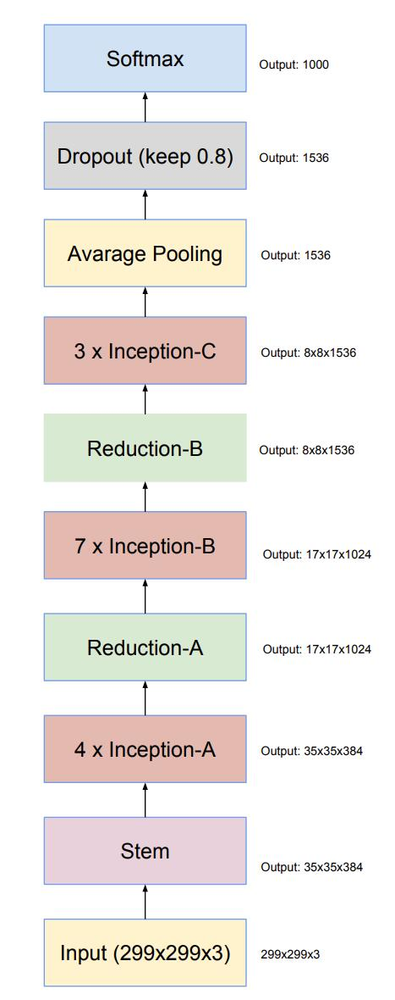

# InceptionV4

***
> [InceptionV4: Inception-v4, Inception-ResNet and the Impact of Residual Connections on Learning](https://arxiv.org/pdf/1602.07261.pdf)

## Introduction

***
InceptionV4 studies whether the Inception module combined with Residual Connection can be improved. It is found that the
structure of ResNet can greatly accelerate the training, and the performance is also improved. An Inception-ResNet v2
network is obtained, and a deeper and more optimized Inception v4 model is also designed, which can achieve comparable
performance with Inception-ResNet v2.



## Benchmark

***

|        |              |           |           |    Pynative     |  Pynative  |     Graph      |   Graph    |           |            |
| :----: | ------------ | :-------: | :-------: | :-------------: | :--------: | :------------: | :--------: | :-------: | :--------: |
|        | Model        | Top-1 (%) | Top-5 (%) | train (s/epoch) | Infer (ms) | train(s/epoch) | Infer (ms) | Download  |   Config   |
|  GPU   | inception_v4 |           |           |    1702.063     |            |    1895.667    |            | [model]() | [config]() |
| Ascend | inception_v4 |           |           |                 |            |                |            |           |            |

## Examples

***

### Train

- The [yaml config files](../../configs) that yield competitive results on ImageNet for different models are listed in
  the `configs` folder. To trigger training using preset yaml config.

  ```shell
  comming soon
  ```

- Here is the example for finetuning a pretrained InceptionV3 on CIFAR10 dataset using Momentum optimizer.

  ```shell
  python train.py --model=inception_v4 --pretrained --opt=momentum --lr=0.001 dataset=cifar10 --num_classes=10 --dataset_download
  ```

Detailed adjustable parameters and their default value can be seen in [config.py](../../config.py).

### Eval

- To validate the model, you can use `validate.py`. Here is an example to verify the accuracy of pretrained weights.

  ```shell
  python validate.py --model=inception_v4 --dataset=imagenet --val_split=val --pretrained
  ```

- To validate the model, you can use `validate.py`. Here is an example to verify the accuracy of your training.

  ```shell
  python validate.py --model=inception_v4 --dataset=imagenet --val_split=val --ckpt_path='./ckpt/inception_v4-best.ckpt'
  ```
