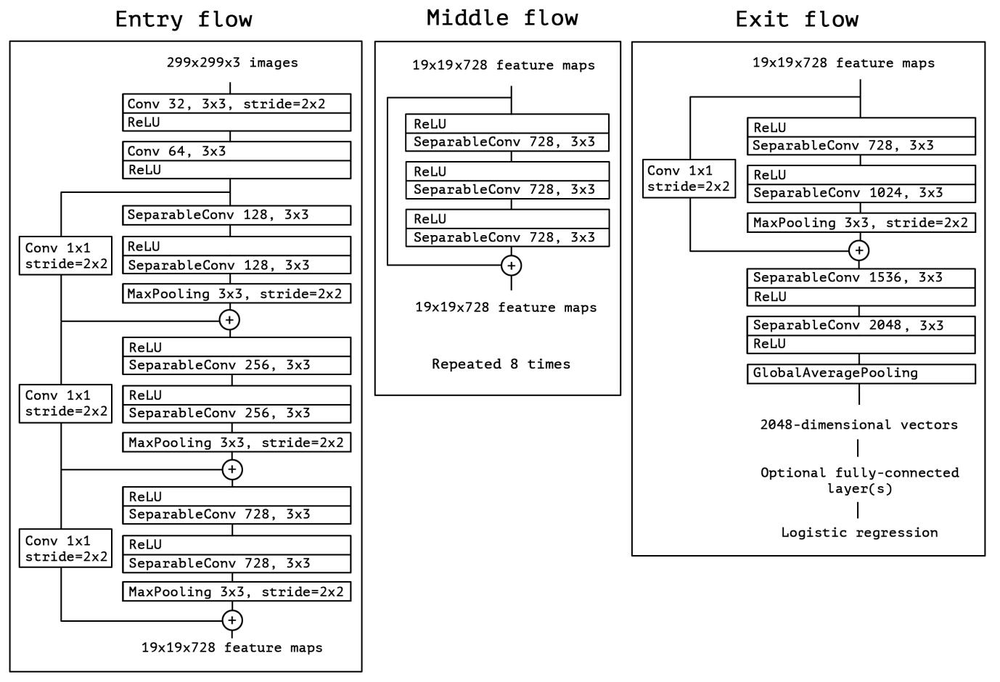

# Xception

***
> [Xception: Deep Learning with Depthwise Separable Convolutions](https://arxiv.org/pdf/1610.02357.pdf)

## 模型简介

***
Xception是除了InceptionV4之外InceptionV3的另一个改进版本，该网络引入了深度可分离卷积结构。在Inception系列网络中，Inception模块主要作为普通卷积操作和深度可分离卷积操作之间的过渡。从这个角度讲，深度可分离卷积可以被视为具有最多的分支的Inception模块。受到这一发现和残差网络的思想的启发，研究人员使用深度可分离卷积来替代Inception模块。



## 性能指标

***

|        |          |           |           |    Pynative     |  Pynative  |     Graph      |   Graph    |           |            |
| :----: | -------- | :-------: | :-------: | :-------------: | :--------: | :------------: | :--------: | :-------: | :--------: |
|        | Model    | Top-1 (%) | Top-5 (%) | train (s/epoch) | Infer (ms) | train(s/epoch) | Infer (ms) | Download  |   Config   |
|  GPU   | xception |           |           |                 |            |                |            | [model]() | [config]() |
| Ascend | xception |           |           |                 |            |                |            |           |            |

## 示例

***

### 训练

- 下面是使用预设的yaml配置文件启动训练的示例.

> [configs文件夹](../../configs)中列出了mindcv套件所包含的模型的各个规格的yaml配置文件(在ImageNet数据集上训练和验证的配置)。

  ```shell
  comming soon
  ```

- 下面是使用在ImageNet上预训练的Xception模型和Momentum优化器在CIFAR10数据集上进行微调的示例。

  ```shell
  python train.py --model=xception --pretrained --opt=momentum --lr=0.001 dataset=cifar10 --num_classes=10 --dataset_download
  ```

详细的可调参数及其默认值可以在[config.py](../../config.py)中查看。

### 验证

- 下面是使用`validate.py`文件验证Xception的预训练模型的精度的示例。

  ```shell
  python validate.py --model=xception --dataset=imagenet --val_split=val --pretrained
  ```

- 下面是使用`validate.py`文件验证Xception的自定义参数文件的精度的示例。

  ```shell
  python validate.py --model=xception --dataset=imagenet --val_split=val --ckpt_path='./ckpt/xception-best.ckpt'
  ```
